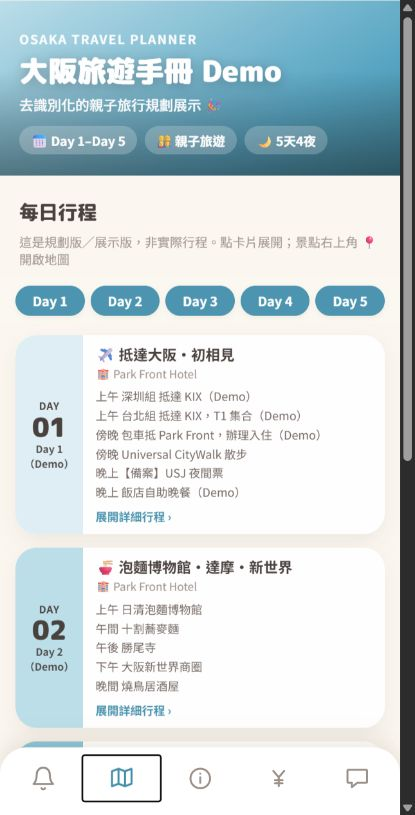
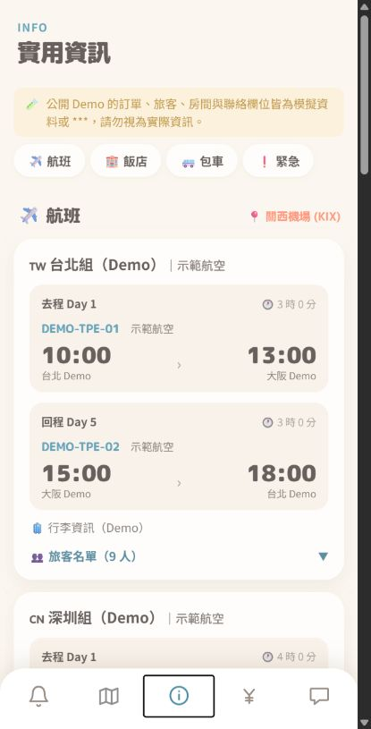

# 大阪旅遊手冊 Demo

> A de-identified, mobile-first travel handbook for a five-day Osaka and Nara trip.

這是一個從私人旅遊手冊整理出的公開作品集 Demo。它保留原 Netlify 版本的手冊 UI 與互動方式，但將實際旅遊中的個人資料、訂單資料、聯絡方式與私人財務資訊全部移除，改以模擬資料呈現。

## Portfolio snapshot

| 面向 | 說明 |
| --- | --- |
| Project type | Mobile-first travel planning web app |
| Product context | 旅途中快速查看行程、景點、住宿與實用工具 |
| Scope | Osaka／Nara 五日行程展示 |
| Stack | HTML、CSS、Vanilla JavaScript、localStorage |
| Deployment direction | Local preview first；後續可部署至 GitHub Pages |
| Data boundary | 去識別化資料、`***` 與合成 Demo 資料 |

## Why this project

旅行中的資訊通常分散在訊息、訂單、地圖與筆記裡。這個專案將它們整理成一個適合手機單手操作的數位手冊，讓使用者可以快速找到當日行程、景點介紹、住宿資訊、緊急資訊、匯率工具與常用日文。

這次公開化的重點不是重做一個全新的視覺，而是以實際使用過的 Netlify 版本為基礎，保留原本的資訊架構與視覺語言，再建立清楚的公開資料邊界。

## Role and contribution

- 將私人旅遊工具重新整理成可公開展示的作品集 Demo。
- 以原始 Netlify 版作為 UI 基準，拆分 HTML、CSS、互動程式與 Demo data。
- 將旅客、航班、訂單、房間、包車與導遊資訊轉換為 `***` 或合成資料。
- 保留公開景點與飯店資訊，並加入「規劃版／非實際行程」說明。
- 完成圖片 metadata、隱私字串、API key、外部連結與前端錯誤檢查。
- 準備成可用於 GitHub Pages 的純靜態網站。

## Product decisions

### Mobile-first by intent

這個網站原本就是旅行中使用的手機手冊，因此主要介面維持窄版、卡片式與底部導覽。電腦瀏覽器上會以置中的手機體驗呈現，不另外製作側邊欄或多欄 Dashboard，避免偏離真實使用情境，也避免維護兩套 UI。

### Public／private separation

私人使用版本保留在 Netlify／PWA 環境；本 repo 是獨立的公開 Demo，預計使用 GitHub Pages。公開版不連結私人網站、私人影片或私人資料來源。

### Privacy by replacement

敏感區塊仍保留原本的資訊架構，讓作品可以展示收合、複製與本機編輯等互動，但內容改為 `***`、`Demo` 或合成旅客資料。這樣可以展示產品設計能力，又不需要把實際訂單與聯絡資料放入公開 repo。

## Features

- 首頁公開版資料聲明與示範公告卡。
- Day 1–Day 5 行程卡片與景點詳細介紹。
- 景點與飯店圖片、公開地圖搜尋連結及官方票券連結。
- 航班、住宿、房間分配、包車與緊急資訊收合區塊。
- 固定 Demo 匯率計算機，不使用即時匯率或任何旅費結算資料。
- 常用日文卡片與瀏覽器語音朗讀。
- 可編輯的 Demo 欄位只儲存在目前瀏覽器的 `localStorage`。
- 無後端、無分析工具、無 API key、無私人媒體連結。

## Preview

<p align="center">
  
  
  
</p>

## Tech and structure

```text
index.html          page shell and five screens
styles.css          original handbook visual system and responsive layout
app.js              rendering, navigation and interaction logic
demo-data.js        replaceable de-identified trip data
assets/             icons and decorative artwork
照片資源/            destination and hotel display assets
docs/screenshots/   portfolio preview images
CREDITS.md          asset credits and redistribution notes
LICENSE             MIT license for source code only
```

## Privacy and security boundary

- 不包含真實姓名、電話、Email、訂位編號、房號、付款紀錄、費用結算或私人聯絡方式。
- 不包含私人 Netlify URL、私人影片 URL、後端 endpoint、API key、analytics 或 tracking script。
- Google Maps 的 `api=1` 是公開網址參數，不是 API key。
- 外部連結僅限公開地圖、官方旅遊／醫療資訊、官方景點票券與字型資源。
- 所有 Demo 圖片已掃描並移除 EXIF／comment metadata。
- 可編輯欄位只寫入目前瀏覽器的 `localStorage`，不會送到伺服器。

## Local preview

因為網站使用分離的 JavaScript 檔案，請透過任一個靜態伺服器預覽，不要直接雙擊 `index.html`。啟動後開啟本機網址即可。

目前預覽網址：`http://127.0.0.1:8765/`

## Known boundaries

- 這是規劃版與作品集展示，不代表實際行程。
- 航班、旅客名單、訂單、房間與聯絡資訊都是 Demo 資料。
- 匯率是固定示範值，不是即時金融資料。
- 景點、飯店、票券、營業時間與緊急資訊可能變動，實際使用時應以官方最新資訊為準。
- 圖片與第三方素材不包含在 source code 的 MIT 授權中，請先閱讀 [CREDITS.md](CREDITS.md)。

## License

Source code is released under the MIT License. Images and third-party assets are excluded from that code license. See [CREDITS.md](CREDITS.md) before reusing any visual asset.
