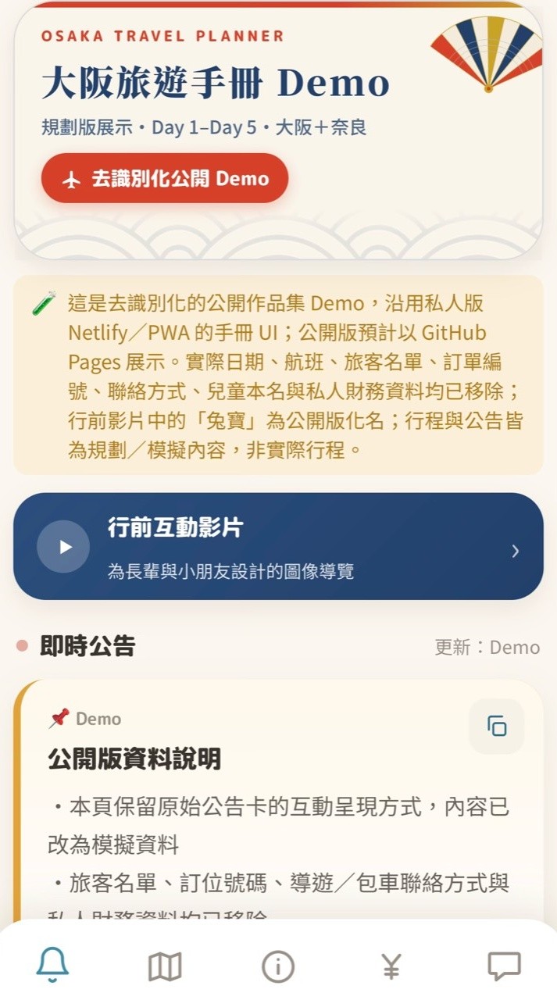
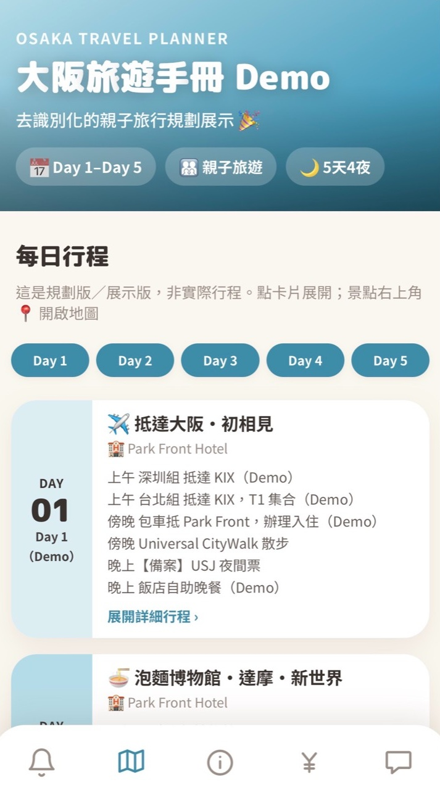
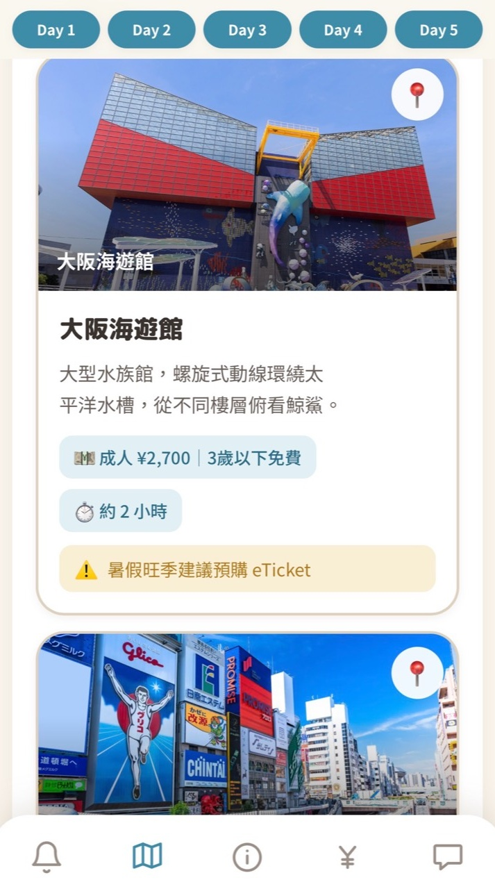
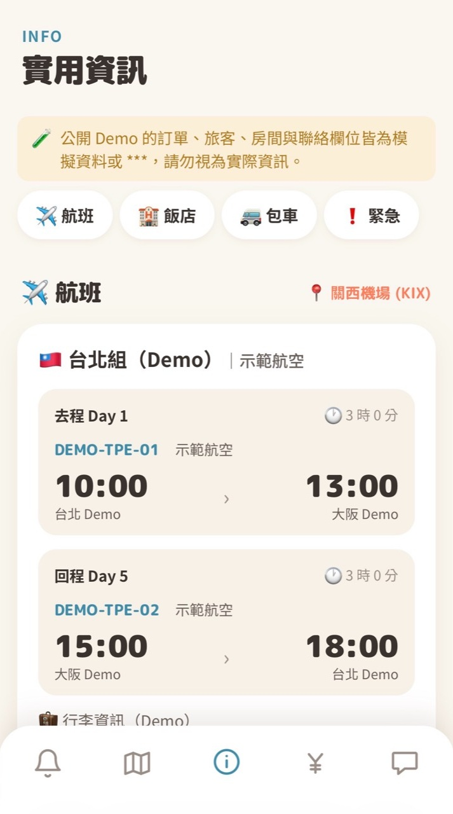

# Osaka Travel Handbook Demo

> A de-identified, mobile-first travel handbook for a five-day Osaka and Nara trip.

This is a public portfolio demo derived from a private travel handbook. It preserves the original Netlify version's UI and interaction model while removing personal, booking, contact, and private financial information. The project also includes a mobile-first interactive pre-trip guide designed to explain the journey to older family members and children through large text, images, and short captions.

**Live Demo:** [Open the GitHub Pages site](https://wakeuplate.github.io/osaka-family-trip-2026-demo/)<br>
**GitHub Repository:** [wakeuplate/osaka-family-trip-2026-demo](https://github.com/wakeuplate/osaka-family-trip-2026-demo)<br>
**繁體中文版:** [README.md](README.md)

## Preview

<p align="center">
  
  
  
</p>
<p align="center">
  
  
  
</p>

## Portfolio snapshot

| Area | Description |
| --- | --- |
| Project type | Mobile-first travel planning web app |
| Product context | Quick access to itineraries, attractions, hotels, and travel utilities |
| Scope | Five-day Osaka and Nara itinerary demo |
| Stack | HTML, CSS, Vanilla JavaScript, and localStorage |
| Deployment | Static site deployed on GitHub Pages |
| Data boundary | De-identified data, `***`, and synthetic demo values |

## Why this project

Travel information is often scattered across messages, bookings, maps, and notes. This project turns that fragmented information into a mobile handbook for quickly checking daily plans, attractions, hotels, emergency information, currency calculations, and useful Japanese phrases.

The public version is intentionally not a visual redesign. It starts from a travel handbook that was actually used on Netlify, preserves its information architecture and visual language, and establishes a clear boundary between private operational data and public portfolio content.

## Role and contribution

- Reframed a private travel utility as a public portfolio demo.
- Used the original Netlify UI as the visual baseline and separated the HTML shell, CSS system, interaction logic, and demo data.
- Replaced passenger, flight, booking, room, charter, and guide information with `***` or synthetic values.
- Preserved public attraction and hotel information while adding clear planning-demo notices.
- Designed the pre-trip guide around older family members and children through large text, image-led storytelling, short captions, and tap-based scene changes.
- Audited image metadata, privacy strings, API keys, external links, and frontend errors before publication.
- Prepared the project as a static GitHub Pages site with no backend dependency.

## Product decisions

### Mobile-first by intent

The original product was a phone handbook used during travel, so the public demo keeps its narrow card layout and bottom navigation. Desktop browsers show the centered phone experience rather than a separate sidebar or dashboard UI, keeping the implementation aligned with the actual use case.

### Public／private separation

The private operational version remains in a Netlify／PWA environment, while this repository is an independent public demo hosted on GitHub Pages. The public version does not link to the private site, private media, or private data sources. The pre-trip guide is also included as a de-identified copy inside the repository.

### Privacy by replacement

Sensitive sections keep their original information architecture so the demo can show collapsible panels, copy interactions, and local editing. Actual values are replaced with `***`, `Demo`, or synthetic travel data instead of exposing real bookings or contacts.

## Features

- Public data-boundary notice and demo announcement cards on the home screen.
- Day 1–Day 5 itinerary cards with attraction details.
- Attraction and hotel images, public map search links, and official ticket links.
- Collapsible flight, hotel, room assignment, charter, and emergency-information sections.
- Fixed demo currency calculator with no live exchange-rate or expense-settlement data.
- Japanese phrase cards with browser speech synthesis.
- Editable demo fields stored only in the current browser's `localStorage`.
- Interactive pre-trip guide with autoplay, tap-to-advance, and press-and-hold fast-forward interactions.
- No backend, analytics, API keys, or private media URLs.

## Privacy and security boundary

- No real names, phone numbers, email addresses, booking references, room numbers, payment records, expense settlements, or private contacts.
- No private Netlify URL, private video URL, backend endpoint, API key, analytics, or tracking script.
- Flight, date, and traveler information in the pre-trip guide are demo values; “兔寶” is a public alias, not a real name.
- The Google Maps `api=1` value is a public URL parameter, not an API key.
- External links are limited to public maps, official travel／medical information, official attraction tickets, and font resources.
- Demo images were scanned and stripped of EXIF and comment metadata.
- Editable fields use browser-local `localStorage` only and are not sent to a server.

## Local preview

Because the site uses separate JavaScript files, run it through any static server for local preview instead of opening `index.html` directly. The deployed version is available at the [GitHub Pages Demo](https://wakeuplate.github.io/osaka-family-trip-2026-demo/).

## Known boundaries

- This is a planning and portfolio demo, not a record of an actual itinerary.
- Flights, passengers, bookings, rooms, and contact information are demo data.
- Exchange rates are fixed demonstration values, not live financial data.
- Attraction, hotel, ticket, opening-hour, and emergency information may change; real use should follow the latest official sources.
- Images and third-party assets are excluded from the MIT license for the source code. See [CREDITS.md](CREDITS.md) before reuse.

## Tech and structure

```text
index.html          page shell and five screens
styles.css          original handbook visual system and responsive layout
app.js              rendering, navigation and interaction logic
demo-data.js        replaceable de-identified trip data
assets/             icons and decorative artwork
照片資源/            destination and hotel display assets
docs/screenshots/   portfolio preview images
行前影片/            de-identified interactive pre-trip guide
CREDITS.md          asset credits and redistribution notes
README.md           Traditional Chinese documentation
LICENSE             MIT license for source code only
```

## License

Source code is released under the MIT License. Images and third-party assets are excluded from that code license. See [CREDITS.md](CREDITS.md) before reusing any visual asset.
